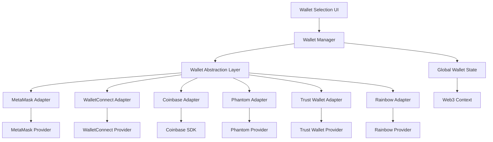

# Multi-Wallet Integration Design

## Overview

The multi-wallet integration will transform NoCensor TV from a MetaMask-only platform to a comprehensive Web3 application supporting the most popular wallet providers. This design implements a modular wallet abstraction layer that can easily accommodate new wallet providers while maintaining a consistent user experience.

## Architecture

### High-Level Architecture



### Component Structure

```
src/
├── context/
│   ├── Web3Context.tsx (Enhanced)
│   └── WalletContext.tsx (New)
├── services/
│   ├── wallets/
│   │   ├── WalletManager.ts
│   │   ├── adapters/
│   │   │   ├── BaseWalletAdapter.ts
│   │   │   ├── MetaMaskAdapter.ts
│   │   │   ├── WalletConnectAdapter.ts
│   │   │   ├── CoinbaseAdapter.ts
│   │   │   ├── PhantomAdapter.ts
│   │   │   ├── TrustWalletAdapter.ts
│   │   │   └── RainbowAdapter.ts
│   │   └── types.ts
├── components/
│   ├── wallet/
│   │   ├── WalletSelectionModal.tsx
│   │   ├── WalletButton.tsx (Enhanced)
│   │   ├── WalletIcon.tsx
│   │   └── WalletConnectionStatus.tsx
└── hooks/
    ├── useWallet.ts
    └── useWalletConnection.ts
```

## Components and Interfaces

### 1. Wallet Abstraction Layer

#### BaseWalletAdapter Interface
```typescript
interface BaseWalletAdapter {
  name: string;
  icon: string;
  isAvailable(): boolean;
  connect(): Promise<WalletConnection>;
  disconnect(): Promise<void>;
  getAccounts(): Promise<string[]>;
  switchNetwork(chainId: string): Promise<void>;
  signMessage(message: string): Promise<string>;
  sendTransaction(transaction: any): Promise<string>;
  on(event: string, callback: Function): void;
  off(event: string, callback: Function): void;
}
```

#### WalletConnection Interface
```typescript
interface WalletConnection {
  address: string;
  chainId: string;
  provider: any;
  walletType: WalletType;
  isConnected: boolean;
}
```

### 2. Wallet Manager Service

The WalletManager acts as the central coordinator for all wallet operations:

```typescript
class WalletManager {
  private adapters: Map<WalletType, BaseWalletAdapter>;
  private currentWallet: WalletConnection | null;
  
  async connectWallet(walletType: WalletType): Promise<WalletConnection>;
  async disconnectWallet(): Promise<void>;
  async switchWallet(walletType: WalletType): Promise<WalletConnection>;
  getAvailableWallets(): WalletInfo[];
  getCurrentWallet(): WalletConnection | null;
}
```

### 3. Wallet Selection Modal

A responsive modal that displays all available wallet options:

**Features:**
- Grid layout of wallet options
- Installation status indicators
- Mobile-optimized design
- QR code display for WalletConnect
- Error handling and retry mechanisms

### 4. Enhanced Web3 Context

The existing Web3Context will be enhanced to work with the new wallet system:

```typescript
interface Web3ContextType {
  // Existing properties
  connectWallet: (walletType?: WalletType) => Promise<void>;
  disconnectWallet: () => Promise<void>;
  switchWallet: (walletType: WalletType) => Promise<void>;
  
  // New properties
  availableWallets: WalletInfo[];
  currentWalletType: WalletType | null;
  isConnecting: boolean;
  connectionError: string | null;
}
```

## Data Models

### Wallet Types
```typescript
enum WalletType {
  METAMASK = 'metamask',
  WALLETCONNECT = 'walletconnect',
  COINBASE = 'coinbase',
  PHANTOM = 'phantom',
  TRUST = 'trust',
  RAINBOW = 'rainbow'
}
```

### Wallet Information
```typescript
interface WalletInfo {
  type: WalletType;
  name: string;
  icon: string;
  description: string;
  isInstalled: boolean;
  isAvailable: boolean;
  downloadUrl: string;
  deepLinkUrl?: string; // For mobile
}
```

### Connection State
```typescript
interface ConnectionState {
  isConnecting: boolean;
  isConnected: boolean;
  currentWallet: WalletConnection | null;
  error: WalletError | null;
  lastConnectedWallet: WalletType | null;
}
```

## Error Handling

### Error Types
```typescript
enum WalletErrorType {
  NOT_INSTALLED = 'not_installed',
  CONNECTION_REJECTED = 'connection_rejected',
  NETWORK_ERROR = 'network_error',
  UNSUPPORTED_NETWORK = 'unsupported_network',
  WALLET_LOCKED = 'wallet_locked',
  UNKNOWN_ERROR = 'unknown_error'
}
```

### Error Recovery Strategies
- **Not Installed**: Show installation instructions and download links
- **Connection Rejected**: Allow retry with clear messaging
- **Network Error**: Provide network troubleshooting steps
- **Unsupported Network**: Guide user to switch networks
- **Wallet Locked**: Prompt user to unlock wallet

## Testing Strategy

### Unit Tests
- Test each wallet adapter independently
- Mock wallet providers for consistent testing
- Test error scenarios and edge cases
- Verify network switching functionality

### Integration Tests
- Test wallet manager coordination
- Verify context state management
- Test modal interactions and flows
- Validate mobile responsiveness

### E2E Tests
- Test complete wallet connection flows
- Verify cross-wallet switching
- Test mobile wallet connections
- Validate error handling paths

### Manual Testing Checklist
- [ ] MetaMask connection and switching
- [ ] WalletConnect QR code scanning
- [ ] Coinbase Wallet browser extension
- [ ] Phantom Ethereum functionality
- [ ] Trust Wallet mobile and extension
- [ ] Rainbow wallet connection
- [ ] Mobile device compatibility
- [ ] Error scenarios and recovery

## Implementation Phases

### Phase 1: Foundation (Week 1)
- Implement base wallet adapter interface
- Create wallet manager service
- Enhance Web3Context for multi-wallet support
- Build wallet selection modal UI

### Phase 2: Core Wallets (Week 2)
- Implement MetaMask adapter (enhance existing)
- Implement WalletConnect adapter
- Implement Coinbase Wallet adapter
- Add comprehensive error handling

### Phase 3: Additional Wallets (Week 3)
- Implement Phantom adapter
- Implement Trust Wallet adapter
- Implement Rainbow adapter
- Add mobile optimization

### Phase 4: Polish and Testing (Week 4)
- Comprehensive testing across all wallets
- Mobile responsiveness improvements
- Performance optimization
- Documentation and user guides

## Security Considerations

### Wallet Provider Validation
- Verify wallet provider authenticity
- Implement provider injection detection
- Validate network configurations
- Secure storage of wallet preferences

### Permission Management
- Request minimal necessary permissions
- Clear permission explanations to users
- Secure handling of wallet connections
- Proper cleanup on disconnection

### Network Security
- Validate network configurations
- Secure RPC endpoint usage
- Protection against network switching attacks
- Proper handling of chain ID validation

## Performance Considerations

### Lazy Loading
- Load wallet adapters only when needed
- Implement dynamic imports for wallet SDKs
- Optimize bundle size with code splitting

### Connection Persistence
- Store wallet preferences securely
- Implement automatic reconnection
- Optimize connection state management
- Efficient event listener management

### Mobile Optimization
- Optimize for mobile wallet deep links
- Implement efficient QR code generation
- Minimize mobile data usage
- Optimize touch interactions

## Accessibility

### Screen Reader Support
- Proper ARIA labels for wallet options
- Keyboard navigation support
- Clear error message announcements
- Accessible modal interactions

### Visual Accessibility
- High contrast wallet icons
- Clear visual connection states
- Accessible color schemes
- Proper focus indicators

### Mobile Accessibility
- Touch-friendly interface elements
- Proper mobile screen reader support
- Accessible gesture interactions
- Clear mobile error messaging