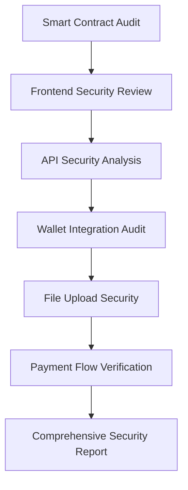
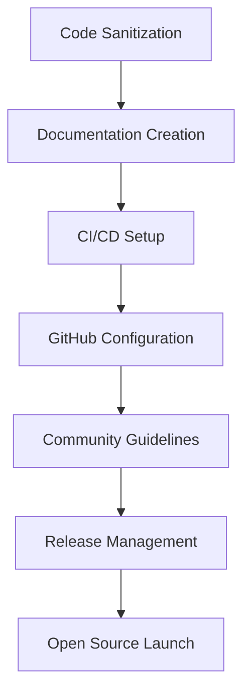
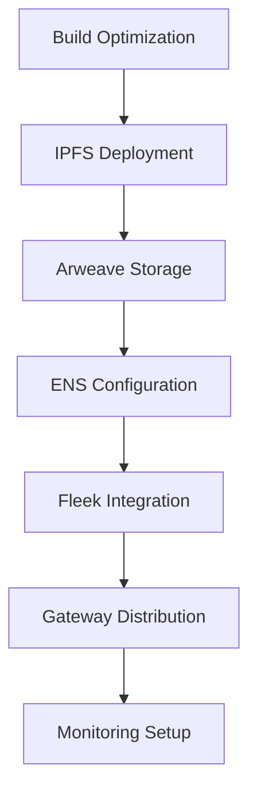

# Web3 Deployment Pipeline Design

## Overview

The Web3 Deployment Pipeline transforms NoCensor TV into a fully decentralized, audited, and open-source platform. This design implements a three-phase approach ensuring security, transparency, and censorship resistance.

## Architecture

### Phase 1: Security Audit Architecture



### Phase 2: Open Source Preparation Architecture



### Phase 3: Decentralized Deployment Architecture



## Components and Interfaces

### 1. Security Audit Components

#### Smart Contract Auditor
- **Purpose**: Comprehensive analysis of all smart contracts
- **Tools**: Slither, MythX, Echidna, Manual Review
- **Output**: Detailed vulnerability report with remediation steps

#### Frontend Security Scanner
- **Purpose**: Analyze React components for security vulnerabilities
- **Tools**: ESLint Security, Semgrep, OWASP ZAP
- **Output**: Frontend security assessment report

#### API Security Analyzer
- **Purpose**: Test all API endpoints for security issues
- **Tools**: Burp Suite, OWASP API Security Testing
- **Output**: API security compliance report

### 2. Open Source Preparation Components

#### Code Sanitizer
- **Purpose**: Remove sensitive data and prepare for public release
- **Functions**:
  - Remove API keys and secrets
  - Clean commit history of sensitive data
  - Implement environment variable management

#### Documentation Generator
- **Purpose**: Create comprehensive project documentation
- **Components**:
  - README.md with setup instructions
  - API documentation
  - Architecture diagrams
  - Contribution guidelines

#### CI/CD Pipeline
- **Purpose**: Automate testing and deployment
- **Tools**: GitHub Actions, Jest, Playwright
- **Features**:
  - Automated testing on PR
  - Security scanning
  - Automated deployment to staging

### 3. Decentralized Deployment Components

#### IPFS Deployer
- **Purpose**: Deploy frontend to IPFS network
- **Features**:
  - Automatic pinning to multiple nodes
  - Content addressing
  - Gateway redundancy

#### Arweave Permanent Storage
- **Purpose**: Store frontend permanently on Arweave
- **Features**:
  - Immutable deployment history
  - Permanent accessibility
  - Version management

#### ENS Domain Manager
- **Purpose**: Configure human-readable domain access
- **Features**:
  - ENS domain registration
  - IPFS hash updates
  - Subdomain management

## Data Models

### Deployment Record
```typescript
interface DeploymentRecord {
  id: string;
  version: string;
  timestamp: Date;
  ipfsHash: string;
  arweaveId: string;
  ensName: string;
  buildHash: string;
  status: 'pending' | 'deployed' | 'failed';
  gateways: Gateway[];
}
```

### Security Audit Report
```typescript
interface SecurityAuditReport {
  id: string;
  timestamp: Date;
  scope: 'smart-contracts' | 'frontend' | 'api' | 'full';
  findings: SecurityFinding[];
  riskLevel: 'low' | 'medium' | 'high' | 'critical';
  status: 'draft' | 'final' | 'remediated';
}
```

### Gateway Configuration
```typescript
interface Gateway {
  name: string;
  url: string;
  type: 'ipfs' | 'arweave';
  status: 'active' | 'inactive';
  responseTime: number;
  uptime: number;
}
```

## Error Handling

### Deployment Failures
- **IPFS Upload Failures**: Retry with different gateways, fallback to local node
- **Arweave Upload Failures**: Queue for retry, use backup wallet if needed
- **ENS Update Failures**: Retry with increased gas, manual intervention alert

### Security Issues
- **Critical Vulnerabilities**: Immediate deployment halt, security team notification
- **Medium/Low Issues**: Document for next release, implement fixes
- **False Positives**: Review and whitelist, update scanning rules

## Testing Strategy

### Security Testing
- **Automated Scans**: Daily security scans on main branch
- **Penetration Testing**: Quarterly professional security assessment
- **Bug Bounty Program**: Community-driven vulnerability discovery

### Deployment Testing
- **Staging Deployments**: Test all deployment processes on staging
- **Gateway Testing**: Verify accessibility through multiple gateways
- **Performance Testing**: Monitor load times and availability

### Integration Testing
- **End-to-End Tests**: Full user journey testing on deployed versions
- **Cross-Browser Testing**: Ensure compatibility across all major browsers
- **Mobile Testing**: Verify mobile responsiveness and functionality

## Monitoring and Analytics

### Deployment Monitoring
- **Gateway Health**: Monitor all IPFS and Arweave gateways
- **Performance Metrics**: Track load times and user experience
- **Availability Monitoring**: 24/7 uptime monitoring with alerts

### Security Monitoring
- **Vulnerability Scanning**: Continuous security monitoring
- **Dependency Monitoring**: Track security updates for all dependencies
- **Incident Response**: Automated security incident detection and response

## Decentralization Strategy

### Multi-Gateway Approach
- **Primary Gateways**: Fleek, Pinata, Infura IPFS
- **Backup Gateways**: Public IPFS gateways, self-hosted nodes
- **Arweave Access**: Multiple Arweave gateways for redundancy

### Content Distribution
- **Geographic Distribution**: Ensure global accessibility
- **Load Balancing**: Distribute traffic across multiple gateways
- **Failover Mechanisms**: Automatic failover to backup gateways

### Community Infrastructure
- **Community Nodes**: Encourage community IPFS node hosting
- **Mirror Sites**: Community-maintained mirrors for additional redundancy
- **Governance Integration**: Community voting on infrastructure decisions