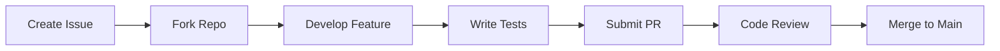

# Contribution Guidelines

## How to Contribute
1. Fork the repository
2. Create your feature branch: `git checkout -b feature/AmazingFeature`
3. Commit changes: `git commit -m 'Add amazing feature'`
4. Push to branch: `git push origin feature/AmazingFeature`
5. Open a pull request

## Coding Standards
- Use TypeScript strict mode
- Follow Solidity style guide
- Write comprehensive tests for all features
- Document complex logic

## Development Workflow

## Security Protocol
- Report vulnerabilities to security@nocensor.tv
- Never commit secrets to repository
- Audit all smart contract changes
