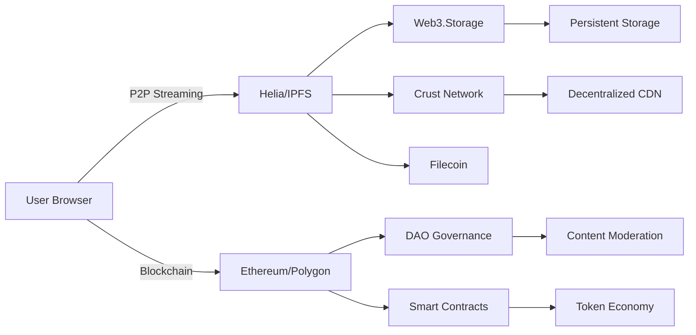

## System Architecture

```mermaid
graph LR
    A[User Browser] -->|P2P Streaming| B[Helia/IPFS]
    A -->|Blockchain| C[Ethereum/Polygon]
    B --> D[Web3.Storage]
    B --> E[Crust Network]
    B --> F[Filecoin]
    C --> G[DAO Governance]
    C --> H[Smart Contracts]
    D --> I[Persistent Storage]
    E --> J[Decentralized CDN]
    G --> K[Content Moderation]
    H --> L[Token Economy]
```
