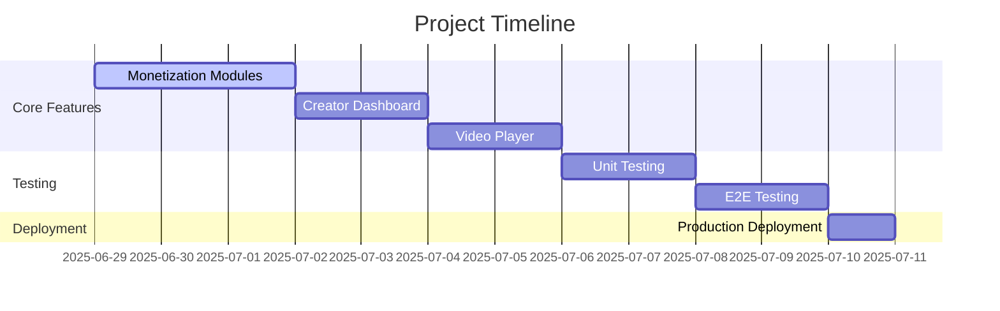
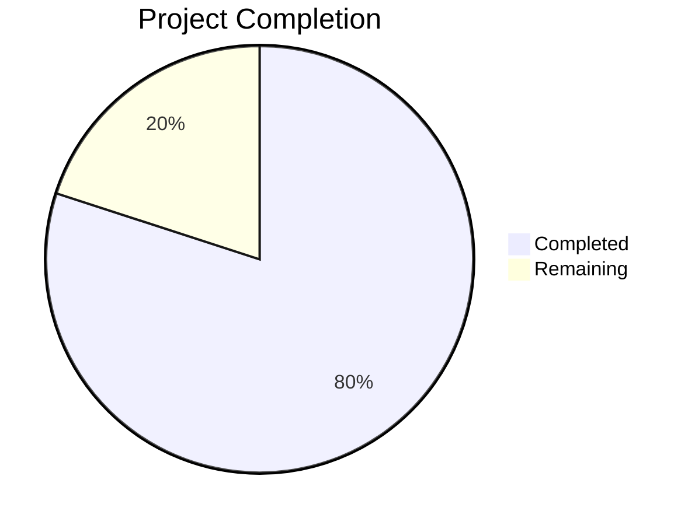

# NoCensor TV Project Status Report

## ✅ Completed Work (80%)

### Core Infrastructure
1. **Blockchain Integration**
   - Wallet connection with Web3React
   - Age verification system
   - Sepolia testnet deployment
2. **Smart Contracts**
   - CreatorDAO governance
   - ContentRegistry
   - Monetization modules (PPV, Subscription, NFT)
3. **Decentralized Storage**
   - IPFS integration with Helia
   - Content upload/download functionality

### Frontend Implementation
1. **Core Components**
   - Web3 context provider
   - Contract interaction utilities
   - Content access control system
2. **Configuration**
   - Vite build system with React
   - Tailwind CSS styling
   - TypeScript type definitions

## 🚧 Remaining Work (20%)

### Core Features
1. **Monetization Implementation**
   - Complete PayPerView module UI
   - Subscription management interface
   - NFT access verification
2. **Content Management**
   - Creator dashboard analytics
   - Content upload workflow
   - Content discovery feed
3. **User Experience**
   - Video player integration
   - Token management interface
   - Notifications system

### Deployment & Testing
1. **Testing**
   - Comprehensive unit tests
   - End-to-end testing
   - Contract security audits
2. **Deployment**
   - Final frontend deployment
   - Mainnet contract deployment
   - Monitoring setup

## 📅 Next Steps
1. Complete monetization module integration
2. Build creator dashboard UI
3. Implement video player with access control
4. Conduct comprehensive testing
5. Deploy to production

## 📊 Current Progress

The project is in its final stages with core infrastructure complete. The remaining work focuses on polishing user experience, thorough testing, and final deployment.